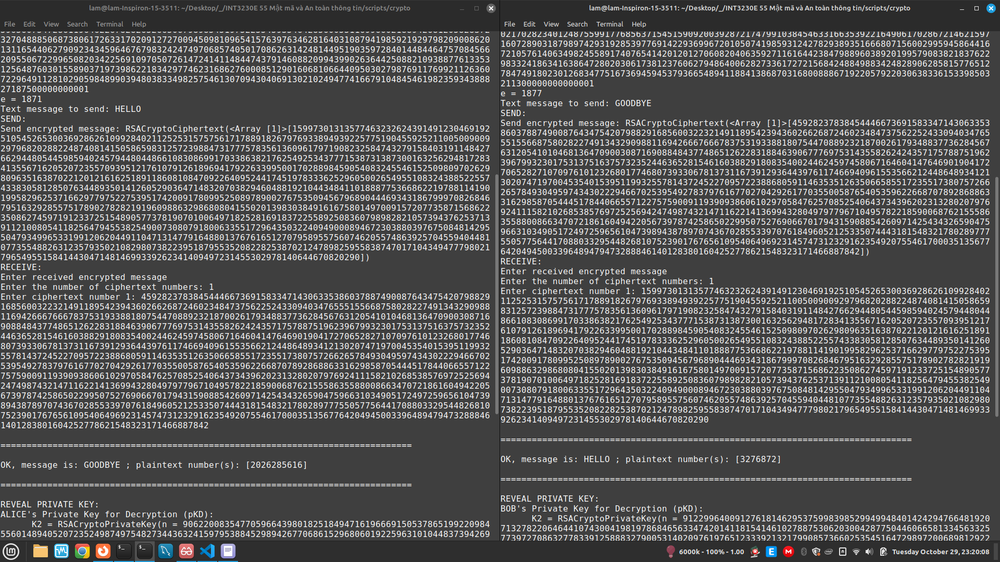
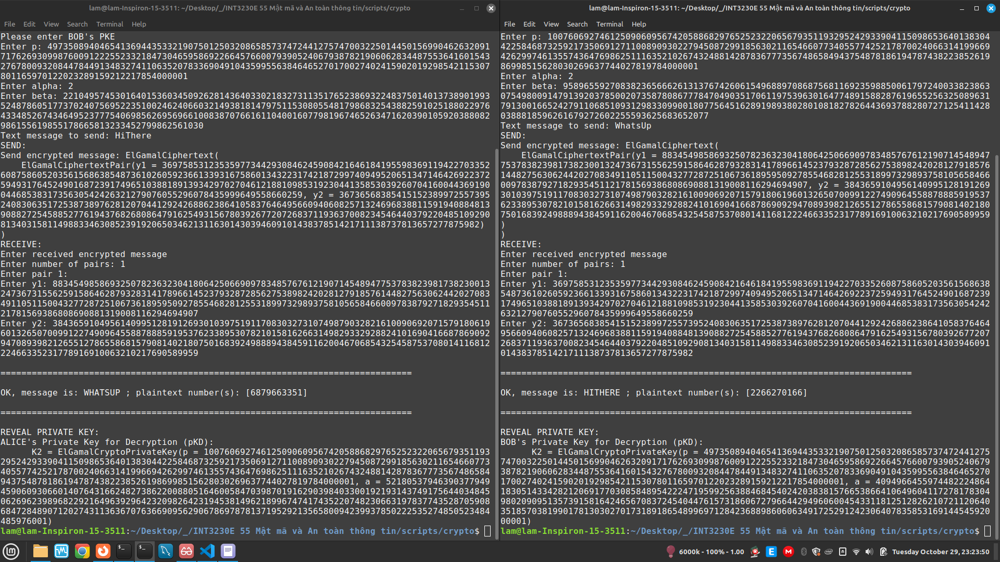
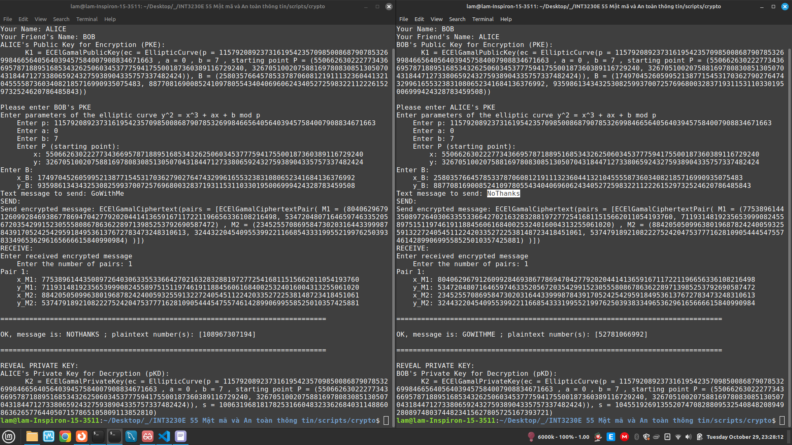
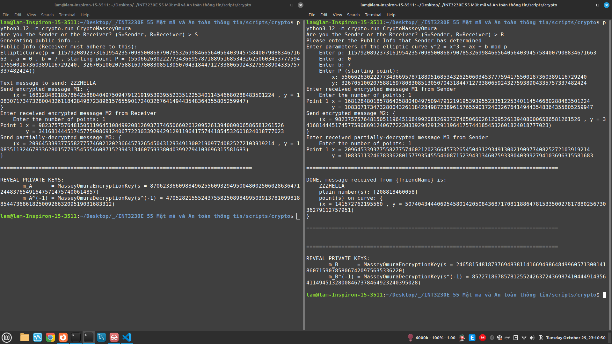
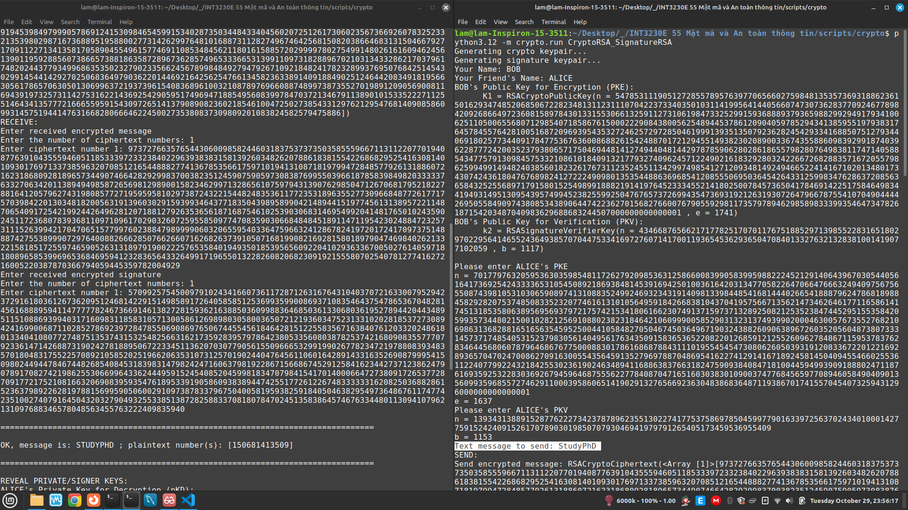
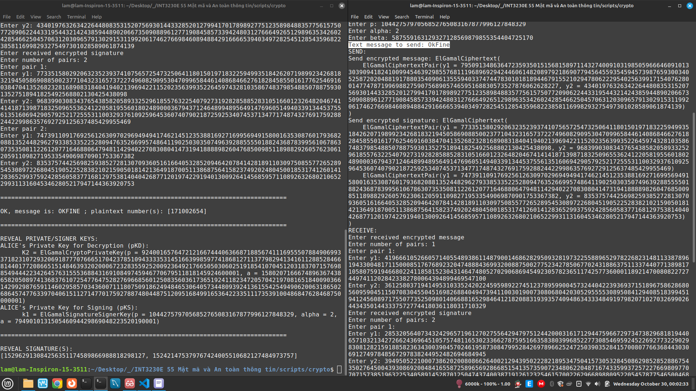
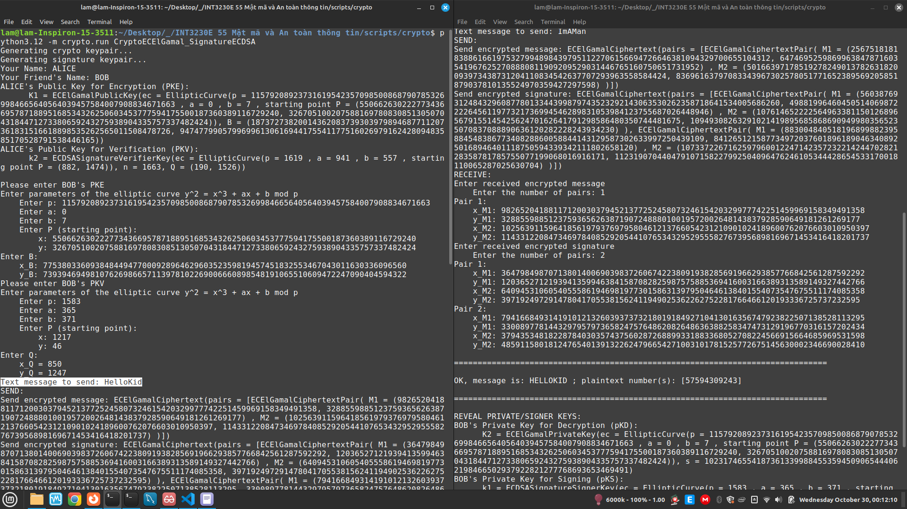

# CryptoEngine

A bunch of scripts implementing popular ciphers and signature
systems, as well as useful mathematical tools in cryptography and
information security.

- [CryptoEngine](#cryptoengine)
  - [Prerequisites](#prerequisites)
  - [How to run](#how-to-run)
  - [Gallery](#gallery)
    - [CryptoRSA](#cryptorsa)
    - [CryptoElGamal](#cryptoelgamal)
    - [CryptoECElGamal](#cryptoecelgamal)
    - [CryptoMasseyOmura](#cryptomasseyomura)
    - [CryptoRSA\_SignatureRSA](#cryptorsa_signaturersa)
    - [CryptoElGamal\_SignatureElGamal](#cryptoelgamal_signatureelgamal)
    - [CryptoECElGamal\_SignatureECDSA](#cryptoecelgamal_signatureecdsa)
    - [Many More](#many-more)
  - [Testing](#testing)
  - [Author](#author)

## Prerequisites

- Python 3.12+ (no external libraries/packages are required)

## How to run

First, `cd` to the project's root.

Run the same command side-by-side (e.g. in two separate
console windows) to simulate communication between two
parties over the network (only the Girault Key Exchange
runner can be run only once to get the information of both
parties).

```sh
python3.12 -m crypto.run XXX
```

where `XXX` is the runner name, given in the following
table. (EC means Elliptic Curve-based)

|    # | Runner name (`XXX`)            | Description                                           | Key length (bits) (\*) | Approximate Time For Generating Key Pairs (seconds) |
| ---: | ------------------------------ | ----------------------------------------------------- | :--------------------: | :-------------------------------------------------: |
|    1 | CryptoRSA                      | RSA Cipher alone                                      |          4096          |                        5 - 6                        |
|    2 | CryptoElGamal                  | ElGamal Cipher alone                                  |          1024          |                        2 - 3                        |
|    3 | CryptoECElGamal                | EC-ElGamal Cipher alone                               |          256           |                  Instantly (\*\*)                   |
|    4 | CryptoMasseyOmura              | EC-Massey-Omura Cipher alone                          |          256           |                  Instantly (\*\*)                   |
|    5 | CryptoRSA_SignatureRSA         | RSA Cipher and Signature System combined              |       4096 & 512       |                (5 - 6) & (Instantly)                |
|    6 | CryptoElGamal_SignatureElGamal | ElGamal Cipher and ElGamal Signature System combined  |       1024 & 128       |                 (2 - 3) & (0.2 - 1)                 |
|    7 | CryptoECElGamal_SignatureECDSA | EC-ElGamal Cipher and ECDSA Signature System combined |        256 & 10        |          (Instantly (\*\*)) & (Instantly)           |
|    8 | KeyExchangeDHElGamal           | ElGamal cipher-based Diffie Hellman Key Exchange      |          1024          |                        2 - 3                        |
|    9 | KeyExchangeDHECElGamal         | EC-ElGamal cipher-based Diffie Hellman Key Exchange   |          256           |                  Instantly (\*\*)                   |
|   10 | KeyExchangeGirault             | Girault Key Exchange                                  |          1024          |            2 seconds to several minutes             |

(\*) Key Length Interpretation:

- For RSA cipher and Girault Key Exchange, it's the bit length of `n = pq`.
- For ElGamal, it's the bit length of `p` the modulus.
- For EC (elliptic curve)-based systems such as EC-ElGamal and EC-Massey-Omura, it's the bit length
    of `p` as in field F_p over which the elliptic curve is formed.
- For runners with combined crypto and signature systems, there are
    two numbers of key length - one for the cipher, the other for
    the signature system - separated by the ampersand `&`.

(\*\*) *Instant* time in those cases are due to a pre-selected
elliptic curve with known properties and is considered safe for
cryptographic uses. That is how the real-world industry is doing
elliptic curve cryptography anyway. In all the other cases,
*Instantly* means the program generates the curves (or whatever
relevant parameters, keys etc.) from scratch.

## Gallery

More images and text reports can be found in the directory `<project_root>/docs/results`.

### CryptoRSA

[View text](./docs/results/CryptoRSA.txt)


### CryptoElGamal

[View text](./docs/results/CryptoElGamal.txt)


### CryptoECElGamal

[View text](./docs/results/CryptoECElGamal.txt)


### CryptoMasseyOmura

[View text](./docs/results/CryptoMasseyOmura.txt)


### CryptoRSA_SignatureRSA

[View text](./docs/results/CryptoRSA_SignatureRSA.txt)


### CryptoElGamal_SignatureElGamal

[View text](./docs/results/CryptoElGamal_SignatureElGamal.txt)


### CryptoECElGamal_SignatureECDSA

[View text](./docs/results/CryptoECElGamal_SignatureECDSA.txt)


### Many More

As noted, more results are available as texts and images in `<project_root>/docs/results`.

## Testing

**Almost every module** has test cases. To run tests written
for a particular module, run it with `test` command-line
argument. For example:

```sh
python3.12 -m crypto.systems test
python3.12 -m crypto.elliptic_curve test
python3.12 -m crypto.prime test
```

etc.

To run all tests, execute the following command:

```sh
python3.12 -m crypto test
```

There are 85 tests, which take 50 seconds to
several minutes in total to complete on
Intel i7-1165G7 @ 2.80GHz × 4.

## Author

Vũ Tùng Lâm 22028235 UET
