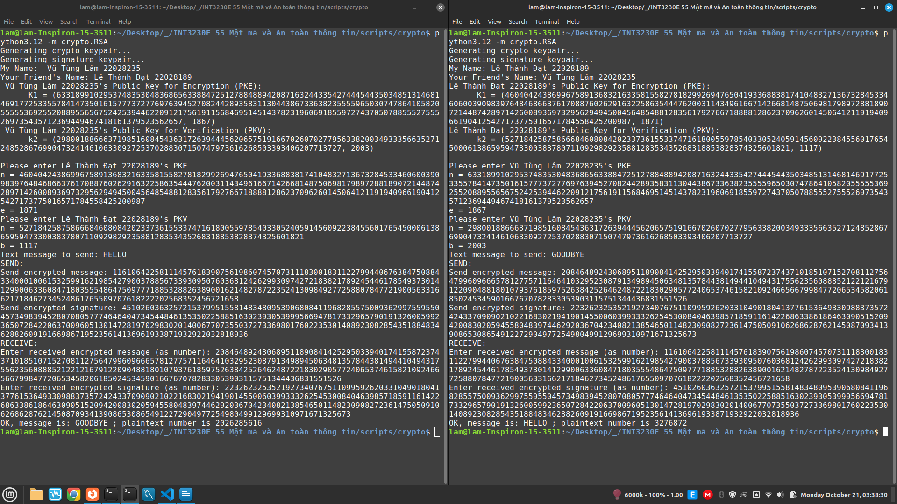
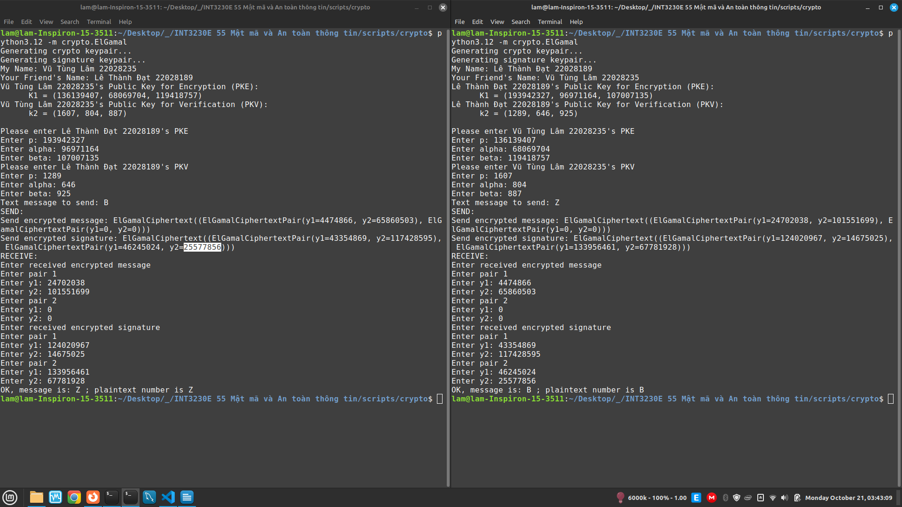
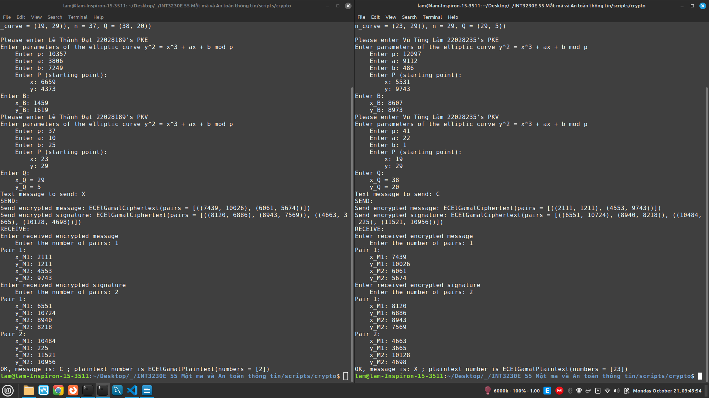

# Crypto Scripts

No SageMath !

- [Crypto Scripts](#crypto-scripts)
  - [Prerequisites](#prerequisites)
  - [How to run](#how-to-run)
  - [Gallery](#gallery)
    - [RSA](#rsa)
    - [ElGamal](#elgamal)
    - [EC-ElGamal + ECDSA](#ec-elgamal--ecdsa)
  - [Testing](#testing)
  - [Authors](#authors)

## Prerequisites

- Python 3.12+

## How to run

First, `cd` to the project's root.

For each of the following command: run the
same command in two separate console windows
to simulate communication.

1. RSA (Cipher and Signature System combined):

    ```sh
    python3.12 -m crypto.RSA
    ```

2. ElGamal (Cipher and Signature System combined):

    ```sh
    python3.12 -m crypto.ElGamal
    ```

3. EC-ElGamal Cipher combined with ECDSA Signature System:

    ```sh
    python3.12 -m crypto.ECElGamal
    ```

## Gallery

### RSA



### ElGamal



### EC-ElGamal + ECDSA



You can view the results in the text files
under the `/docs/results` directory.

## Testing

**Almost every module** has test cases. To run tests written
for a particular module, run it with `test` command-line
argument. For example:

```sh
python3.12 -m crypto.RSA test
python3.12 -m crypto.ElGamal test
python3.12 -m crypto.ECElGamal test
python3.12 -m crypto.prime.is_prime test
```

etc.

## Authors

- Vũ Tùng Lâm 22028235 UET
- Lê Thành Đạt 22028189 UET
